# 🇪🇺 EU AI Act Risk Classifier

[](https://python.org)
[](https://anthropic.com)
[](https://eur-lex.europa.eu/legal-content/EN/TXT/?uri=CELEX:32024R1689)
[](LICENSE)
[]()
[](https://github.com/marcoderoni)

> **AI-powered compliance tool** that classifies any AI system under the EU AI Act (Regulation 2024/1689) — from **Prohibited** to **Minimal Risk** — with applicable obligations, legal basis, and compliance deadlines. Built by a senior EMEA in-house legal counsel.

---

## 📋 Table of Contents

- [Overview](#-overview)
- [Risk Framework](#-eu-ai-act-risk-framework)
- [Demo](#-demo)
- [Features](#-features)
- [Quick Start](#-quick-start)
- [Usage](#-usage)
- [Batch Classification](#-batch-classification)
- [Output Example](#-output-example)
- [Compliance Timeline](#-compliance-timeline)
- [Disclaimer](#-disclaimer)
- [Portfolio](#-portfolio)

---

## 🎯 Overview

The **EU AI Act** (Regulation 2024/1689) entered into force on 1 August 2024 and applies progressively through 2027. It introduces a **risk-based framework** requiring organisations to identify where their AI systems fall on the risk spectrum — with consequences ranging from outright prohibition to specific documentation and audit obligations.

This tool uses **Claude (Anthropic)** as a reasoning engine to:

1. Parse a natural-language description of an AI system
2. Map it against the EU AI Act framework (Articles 5, 6, 51-56, Annex II, Annex III)
3. Return a structured classification with legal basis, obligations, and next steps

Built for **legal, compliance, and product teams** who need rapid, reasoned risk assessments — without manually cross-referencing 144 pages of regulation.

---

## ⚖️ EU AI Act Risk Framework

```
┌─────────────────────────────────────────────────────────────────┐
│  RISK LEVEL       │  LEGAL BASIS      │  KEY OBLIGATION          │
├─────────────────────────────────────────────────────────────────┤
│  🚫 PROHIBITED    │  Article 5        │  Banned. Cannot deploy.  │
│  ⚠️  HIGH-RISK    │  Article 6 +      │  Conformity assessment,  │
│                   │  Annex III        │  registration, audits    │
│  🤖 GPAI          │  Articles 51-56   │  Transparency, copyright │
│                   │                   │  compliance, tech docs   │
│  ℹ️  LIMITED RISK │  Article 50       │  Disclosure obligations  │
│  ✅ MINIMAL RISK  │  —                │  No mandatory obligation │
└─────────────────────────────────────────────────────────────────┘
```

### Annex III — High-Risk Categories

| # | Category | Examples |
|---|----------|---------|
| 1 | **Biometrics** | Remote ID, emotion recognition, biometric categorisation |
| 2 | **Critical Infrastructure** | Transport safety, energy grid management |
| 3 | **Education & Training** | Admissions, exam proctoring, student assessment |
| 4 | **Employment & HR** | CV screening, performance monitoring, task allocation |
| 5 | **Essential Services** | Credit scoring, insurance risk, benefit eligibility |
| 6 | **Law Enforcement** | Crime prediction, evidence reliability, suspect profiling |
| 7 | **Migration & Asylum** | Border risk assessment, asylum decisions, ID verification |
| 8 | **Justice & Democracy** | Judicial decision support, electoral influence |

---

## 🎬 Demo



```bash
# Single system classification
python classifier.py -d "HR tool that scores job applicants using CV analysis"

# Output:
#  ⚠️   Risk Level   : HIGH-RISK
#  📊   Confidence   : HIGH
#  📜   Legal Basis  : Article 6(2) + Annex III, Category 4
#  📁   Annex III    : Category 4 — Employment, workers management
#
#  KEY OBLIGATIONS:
#   • Register in EU AI Act database before deployment
#   • Conduct conformity assessment (internal or third-party)
#   • Implement human oversight mechanism
#   • Maintain technical documentation (Annex IV)
#   • Inform workers of AI system use (transparency)
```

---

## ✨ Features

- **🔍 Single classification** — describe any AI system, get instant risk assessment
- **📦 Batch mode** — classify 10, 50, 100+ systems from CSV/JSON input
- **📜 Legal grounding** — every classification cites specific articles and annexes
- **🎯 Role-specific obligations** — separate outputs for **providers** vs **deployers**
- **⏰ Compliance deadlines** — maps to AI Act's gradual rollout schedule
- **💾 JSON export** — machine-readable reports for integration into compliance workflows
- **🖥️ Interactive mode** — conversational interface for exploratory classification
- **🇪🇺 Framework coverage** — Article 5 (prohibited), Annex III (high-risk), GPAI (Articles 51-56), Article 50 (limited risk)

---

## ⚡ Quick Start

```bash
# 1. Clone
git clone https://github.com/marcoderoni/eu-ai-act-classifier.git
cd eu-ai-act-classifier

# 2. Install dependencies
pip install -r requirements.txt

# 3. Set your API key
cp .env.example .env
# Edit .env and add: ANTHROPIC_API_KEY=your_key_here

# 4. Run
python classifier.py -d "Chatbot for customer support on a bank website"
```

---

## 📖 Usage

### Single Classification

```bash
# Basic
python classifier.py -d "Description of your AI system"

# Save JSON report
python classifier.py -d "Credit scoring model for mortgage applications" --output report.json

# Verbose (shows API call details)
python classifier.py -d "..." --verbose
```

### Interactive Mode

```bash
python classifier.py --interactive
# Enter descriptions one by one, get classifications in real time
# Type 'quit' to exit
```

---

## 📦 Batch Classification

Classify multiple AI systems from a **CSV** or **JSON** file.

### CSV Format

```csv
name,description
HR Screening Tool,AI that ranks job applicants based on CV data and predicted performance
Customer Chatbot,Conversational AI that answers product questions on a website
Credit Scoring Engine,ML model assessing creditworthiness of individual loan applicants
```

### Run Batch

```bash
# Basic batch
python batch_classifier.py -i examples/sample_systems.csv -o results.json

# With CSV summary export
python batch_classifier.py -i examples/sample_systems.csv -o results.json --csv summary.csv

# Custom delay between API calls (default: 1.5s)
python batch_classifier.py -i systems.json --delay 2.0
```

### Batch Output Summary

```
  ─────────────────────────────────────────────────────
  BATCH CLASSIFICATION SUMMARY
  ─────────────────────────────────────────────────────
  ⚠️   HR Screening Tool              HIGH-RISK
  ⚠️   Credit Scoring Engine          HIGH-RISK
  🤖   LLM Foundation Model           GPAI
  ℹ️   Customer Support Chatbot       LIMITED RISK
  ✅   Text Summarisation Tool        MINIMAL RISK
  ─────────────────────────────────────────────────────
```

---

## 📄 Output Example

```json
{
  "risk_level": "HIGH-RISK",
  "confidence": "HIGH",
  "legal_basis": "Article 6(2) + Annex III, Category 4 (employment)",
  "annex_iii_category": "Category 4 — Employment, workers management and access to self-employment",
  "prohibited_practice": null,
  "key_obligations": [
    "Register in the EU AI Act database before deployment",
    "Conduct conformity assessment (internal or third-party notified body)",
    "Maintain technical documentation per Annex IV",
    "Implement human oversight mechanisms",
    "Provide transparency to affected workers"
  ],
  "provider_obligations": [
    "CE marking and EU declaration of conformity",
    "Quality management system (Article 17)",
    "Post-market monitoring plan"
  ],
  "deployer_obligations": [
    "Conduct DPIA if personal data involved (GDPR Art. 35)",
    "Inform workers of AI system use before deployment",
    "Designate a human responsible for oversight",
    "Register use in EU database (if deployer is public authority)"
  ],
  "compliance_deadlines": "High-risk systems under Annex III: obligations apply from 2 August 2026",
  "caveats": "Netherlands: WOR (Wet op de Ondernemingsraden) Art. 27 requires works council approval before implementing AI-based monitoring of employees.",
  "recommendation": "Conduct an internal AI risk assessment and gap analysis immediately. Prioritise technical documentation and human oversight design before the August 2026 compliance deadline."
}
```

---

## 📅 Compliance Timeline

| Date | Milestone |
|------|-----------|
| **1 Aug 2024** | AI Act entered into force |
| **2 Feb 2025** | **Chapter II** (prohibited practices, Article 5) fully applicable |
| **2 Aug 2025** | GPAI rules (Chapter V), governance provisions applicable |
| **2 Aug 2026** | **Annex III high-risk systems** fully applicable |
| **2 Aug 2027** | Full Act applicable (remaining high-risk systems, Annex I) |

---

## 🏗️ Project Structure

```
eu-ai-act-classifier/
├── classifier.py          # Main classifier (single system)
├── batch_classifier.py    # Batch classifier (CSV/JSON input)
├── requirements.txt
├── .env.example
├── LICENSE
├── examples/
│   └── sample_systems.csv # 10 sample AI systems for testing
└── assets/
    └── demo.gif           # Demo animation
```

---

## ⚠️ Disclaimer

This tool provides **AI-assisted legal analysis** for informational and productivity purposes only. It does **not** constitute legal advice. Classifications should be reviewed by a qualified legal professional before reliance for compliance purposes. The EU AI Act is subject to evolving interpretive guidance from the EU AI Office and national competent authorities.

The author is a practising in-house legal counsel, not acting in a legal advisory capacity through this tool.

---

## 🗂️ Portfolio

Part of the **Legal Tech GitHub Portfolio** by [Marco De Roni](https://github.com/marcoderoni) — Senior Commercial Legal Counsel (EMEA) building open-source tools at the intersection of law, AI, and compliance.

| Repo | Description |
|------|-------------|
| [legal-ai-toolkit](https://github.com/marcoderoni/legal-ai-toolkit) | Multi-provider AI contract reviewer (Claude + GPT) |
| [contract-scanner](https://github.com/marcoderoni/contract-scanner) | Single-contract risk scanner with R/Y/G scoring |
| [contract-bulk-analyzer](https://github.com/marcoderoni/contract-bulk-analyzer) | Portfolio-level contract analysis |
| [legal-gpt-reviewer](https://github.com/marcoderoni/legal-gpt-reviewer) | GPT-powered legal review with playbook grounding |
| [legal-knowledge-wiki](https://github.com/marcoderoni/legal-knowledge-wiki) | D3.js knowledge graphs + ontology extraction |
| **eu-ai-act-classifier** | **← You are here** |

---

*Built with ⚖️ and 🐍 in Amsterdam.*
